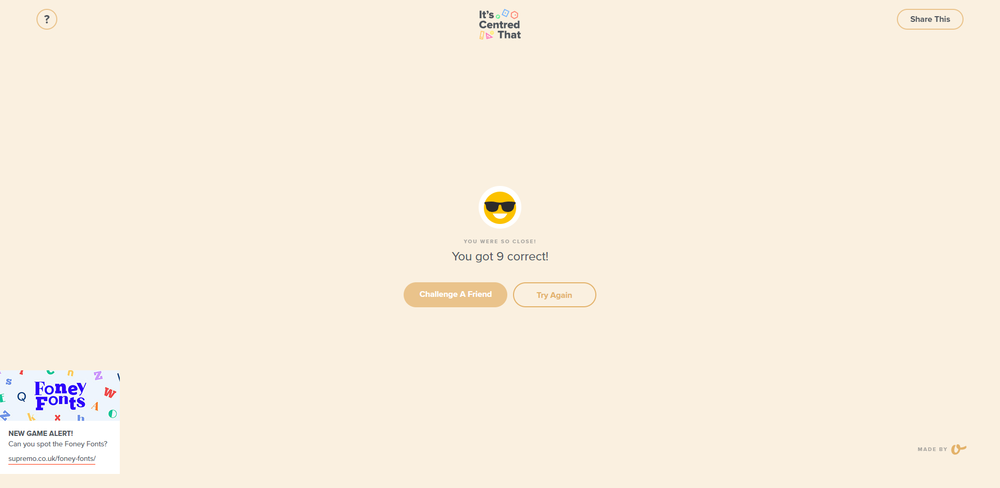

## <h6 align=center> Hello there, my fellow Alfbuddy! 💖 </h6>

  

<!-- You've made it—great job! Now, here's the scoop: this markdown file is your **canvas**. Customize it; let your creativity flow!

Remember, you're free to add your personal touch, but keep the sacred requirements intact; they are the guardians of order here. This markdown file should or may include: -->

#### <h1 align = center> 💜 Day 1: Introduction to UI/UX Design 💜</h1>

  
&nbsp;&nbsp;**User-Experience Analysis:** 

<h3>1. Which website is easier to find the product you are looking for? </h3>
Answer: 
For me the website that is easier to find the product that I'm looking for is Lazada. 

<h3>2. Identify any distractions or unnecessary elements that could potentially confuse users.  </h3>
Answer:
In Lazada the one thing that I think the user will get confuse is the categories, at first I thought that the category section is where the different categories of products is shown, but I'm wrong since it is a category of different products like a category for mobile phones, tablets etc. that I think it can be solve by just putting a main category of gadgets and make it as a sub-category. For Shopee I think there are a lot of buttons that is being used like at the bottom of the search bar there are suggestions that I think it's not necessary since when you type at search a suggestions is also shown. I think there is just a lot of links that a user may find confusing of like their lives and other links that is present in the home page. 

<h3>3. Compare the organization of content between the two platforms. Which between the two platforms’ content is easier to scan and understand?  </h3>
Answer: 
For me the one that is easier to scan and to understand is the Lazada app since it's features is just minimal where the main categories is arrange to it's left side and when you hover the mouse to those categories a sub-category will show up that helps you to find what you are looking much easier.

  &nbsp;&nbsp;**User-Interface Analysis:**

<h3>1. Is the websites’ layout and design visually pleasing and consistent with their brand?  </h3>
Answer:
Lazada is the one that is visually pleasing to me from the way they used colors that is not vibrant and not so bright like Shopee that has a color that is much bright for me and I think it is not good for my eyes that hates a light and vibrant colors.
    
<h3>2. Comment on the responsiveness of both websites across different devices. </h3>
Answer:
There both responsives to it's mobile devices and I can say it looks good.
    
<h3>3. Which do you think is better when it comes to the visual aspect of the website?  </h3>
Answer:
As a person that is not a fan of bright colors or I just want minimal color to use on it's background, then I would the Lazada App for this one, since for me it is visually appealing and I like the way it is the color that is being used is minimal and easier.
    
 

<h2 align=center> It's Centered That </h2>

<!--#### 2. An **optional** screenshot of playing the game **"It's Centred That"** and your feedback

 Ready to include your output for **Day 1**? Let the customization begin! 🚀✨ -->

<!-- You may now delete and modify the content of this file -->
