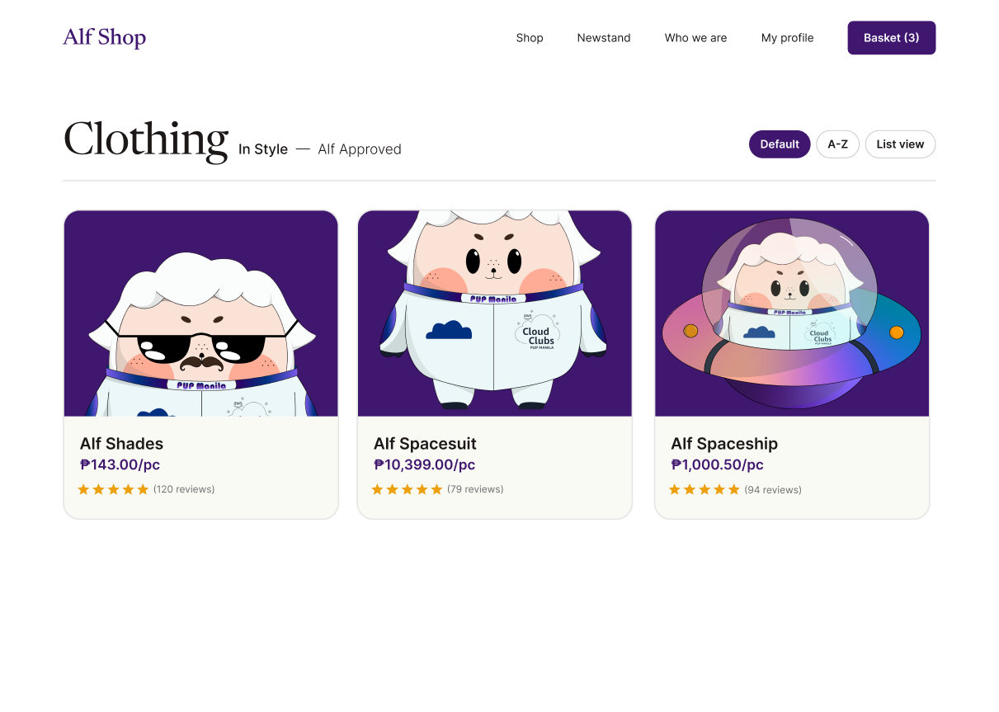
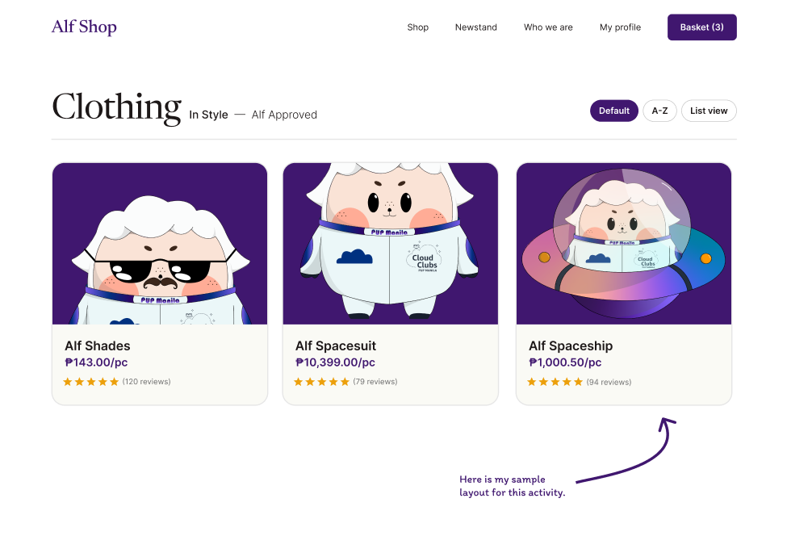

## <h6 align=center> Hello there, my fellow Alfbuddy! 💖 </h6>

#### <h1 align = center> Sample Layout for Day 2 </h1>

<a href="https://www.figma.com/file/X6bRrtArgboh0clmnj2oAq/AWSCC-Figma-Workshop%3A-Basics-(Community)?type=design&node-id=5-1669&mode=design&t=ZlYakcy1WDBfvNpg-0"> Link to Figma Basics Tutorial </a>

##

 
This is my sample layout for this activity, down below is a photo of what part of this sample layout is the one that I work in this activity. My experience for this activity is a fun since I am able to start my new learning in Figma, I am already familiar with the features of Figma so it is easy for me to this activity and the color pallete that is being used is superb since it's my favorite color. One thing that for me to improve, is enhancing my skills when it comes to alignment and spacing, since it's one of my weakness when it comes to designing.

<!--
You've made it—great job! Now, here's the scoop: this markdown file is your **canvas**. Customize it; let your creativity flow!

Remember, you're free to add your personal touch, but keep the sacred requirements intact; they are the guardians of order here. This markdown file should include:
- Link to your own file of **"Figma Basics Tutorial"**
- Brief explanation of your experience or reflection

Ready to include your output for **Day 2**? Let the customization begin! 🚀✨
-->
<!-- You may now delete and modify the content of this file -->
