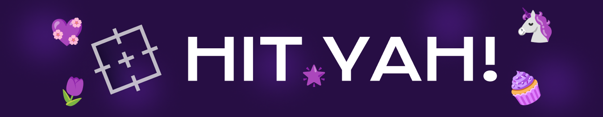
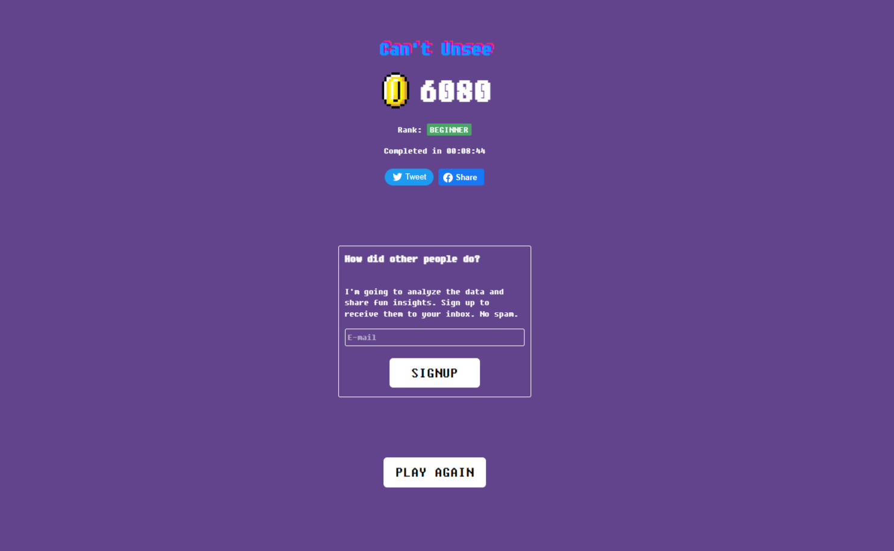

## <h6 align="center">Hello there, my fellow Alfbuddy! 💖</h6>

<h1 align="center"> 💜 Day 3: Design Principles 💜</h1>

<a href="https://www.figma.com/file/VXZMGfq75JZZoE0UYYXkwg/Week-1-%5BDay-3%5D-%3A-Activity-(Community)?type=design&node-id=202-37&mode=design&t=Hkahu1WuJeamQjJH-0">DAY 3 OUTPUT
</a>

Hi Everyone! For the third day of this CodeQuest this is the one that I made for this day. Above is the link to a figma file, so just click it if you want to see what I did today. For this experience I learned a new knowledge that is beneficial to me, since I am not into design back then and I am just starting to figure out more about design and user interface, and this tutorial is helpful for me to be able to have a good design in the future.

##
<h3 align=center>
Game: Can't Unsee
</h3>

<<<<<<< HEAD

=======

>>>>>>> 5eb1d493b235688fd2aae3054b3ab04dfb2bf643

<!--
You've made it—great job! Now, here's the scoop: this markdown file is your **canvas**. Customize it; let your creativity flow!

Remember, you're free to add your personal touch, but keep the sacred requirements intact; they are the guardians of order here. This markdown file should or may include:
- Link to your own file of **"Week 1 [Day 3] : Activity"**
- An **optional** screenshot of playing the game **"Can't Unsee"** and your feedback

Ready to include your output for **Day 3**? Let the customization begin! 🚀✨
-->
<!-- You may now delete and modify the content of this file -->
