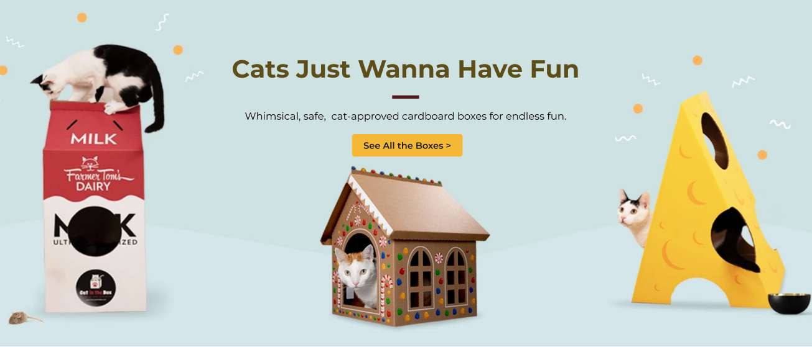

## <h6 align=center> Hello there, my fellow Alfbuddy! 💖 </h6>

<h1 align=center> 💜 Day 4: Design Components 💜 </h1>

To access: <a href="https://www.figma.com/file/0up1UZD8iZE4gRezE4wf3q/Week-1-(day-4)-%3A-Design-Components-(Community)?type=design&node-id=210-8&mode=design&t=PCX3WMhnvAhX4Fzm-0">Week 1 [Day 4] Activities </a>

<h3 align=center> Final Activity: Accesibility </h3>

##

<h3 align=center> Activity: Visual Hierarchy </h3>

##

<h3 align=center> Activity: Typography </h3>

##

<h3 align=center> Activity: Color Pallete </h3>

<!--
You've made it—great job! Now, here's the scoop: this markdown file is your **canvas**. Customize it; let your creativity flow!

Remember, you're free to add your personal touch, but keep the sacred requirements intact; they are the guardians of order here. This markdown file should or may include:

-   Link to your own file of **"Week 1 [Day 4] : Activity"**
-   A screenshot of your final activity output _(optional)_

Ready to include your output for **Day 4**? Let the customization begin! 🚀✨

<!-- You may now delete and modify the content of this file -->
